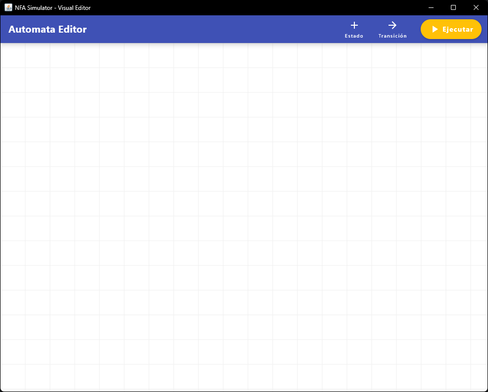
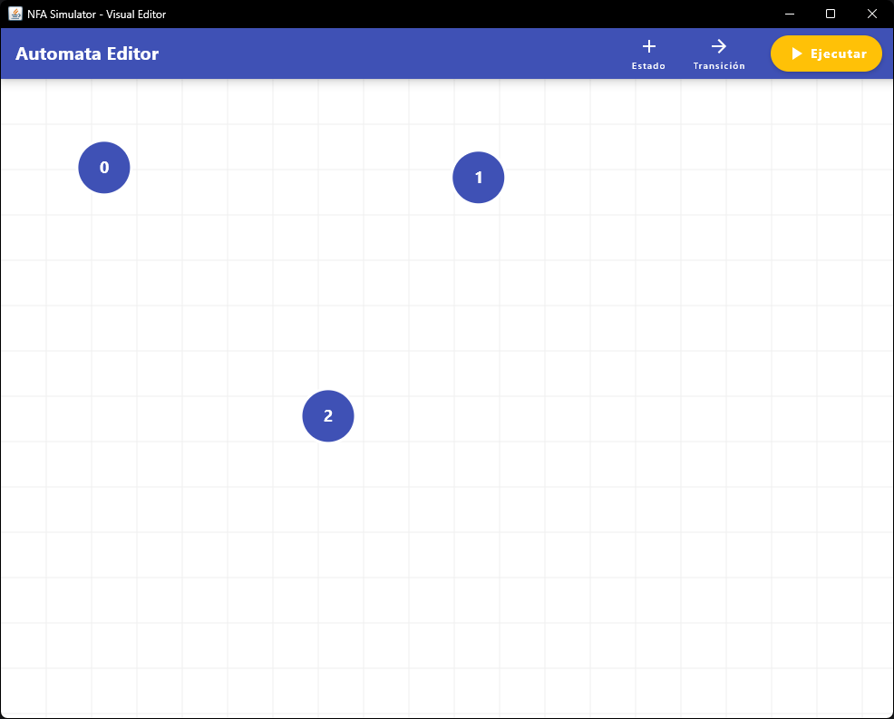
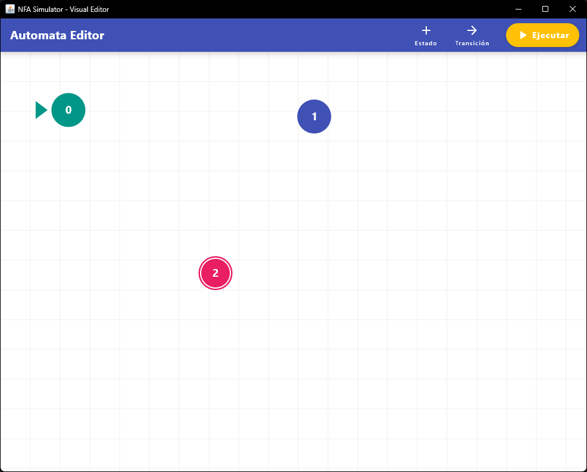
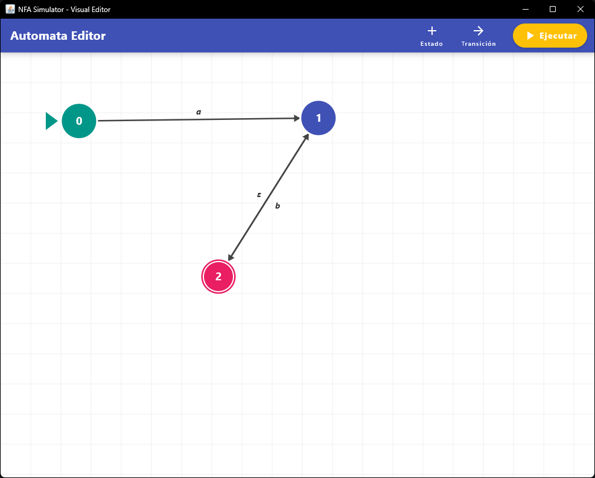
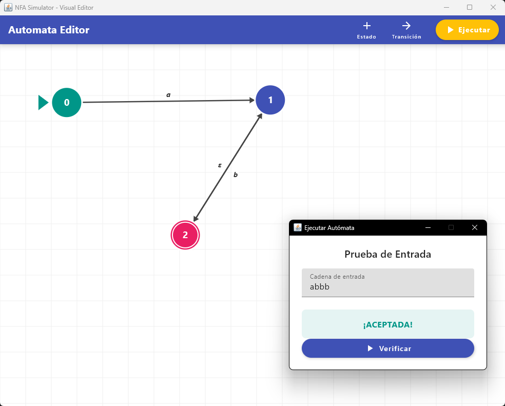
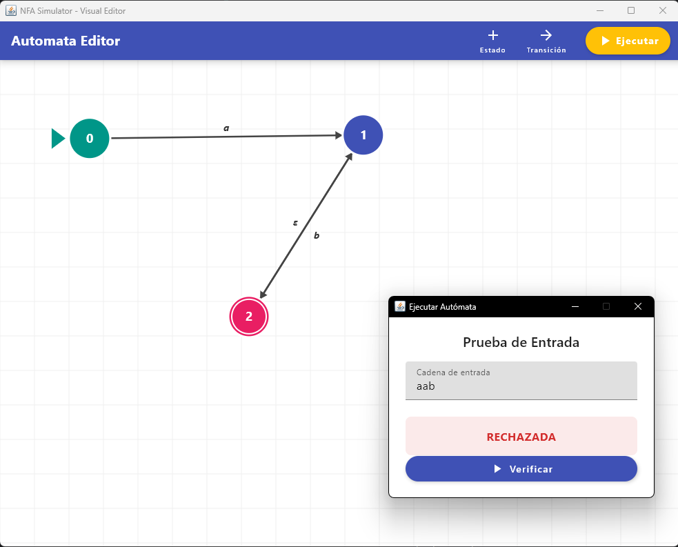

# NFA Simulator - Visual Editor

Un editor visual interactivo y simulador de Autómatas Finitos No Deterministas (AFN / NFA), desarrollado con Kotlin y JetBrains Compose para Desktop. Este proyecto permite diseñar visualmente la estructura de un autómata y evaluar cadenas de texto para comprobar si son aceptadas o rechazadas por el modelo matemático definido.

## Descripción del Proyecto

Este simulador nació con el objetivo de facilitar el diseño y la comprensión del funcionamiento de los Autómatas Finitos No Deterministas. A través de una interfaz gráfica intuitiva construida completamente en **Compose Multiplatform (Desktop)**, los usuarios pueden agregar estados, definir transiciones (incluyendo transiciones vacías o epsilon `ε`), y ejecutar el algoritmo de validación de cadenas en tiempo real.

Es un proyecto ideal que demuestra la capacidad de unir la teoría clásica de la computación con el desarrollo de interfaces gráficas modernas e interactivas mediante código declarativo en Kotlin.

## Características Principales

*   **Editor Visual Interactivo:** Un lienzo (Canvas) infinito donde se pueden crear, mover (drag-and-drop) y eliminar estados libremente usando el cursor.
*   **Tipos de Estados:** Soporte completo para configurar los nodos como estados de tipo `Inicial`, `Normal` o `Final`.
*   **Transiciones Personalizables:** Creación de transiciones entre múltiples estados mediante cualquier carácter, con soporte dedicado para transiciones vacías (epsilon `ε`).
*   **Motor de Simulación:** Un evaluador riguroso que implementa el algoritmo de **Clausura Epsilon** (Epsilon Closure) para determinar si una cadena de entrada es aceptada o rechazada por el autómata diseñado.
*   **Interfaz de Usuario Moderna:** UI diseñada inspirándose en Material Design, incorporando temas personalizados (Primary Blue, Secondary Teal, Accent Amber) y validaciones fluidas.

## Tecnologías Utilizadas

*   **Lenguaje:** [Kotlin](https://kotlinlang.org/) (JVM Toolchain 21) - Tipado estático y paradigma funcional-orientado a objetos.
*   **Framework UI:** [JetBrains Compose para Desktop](https://www.jetbrains.com/lp/compose-multiplatform/) - Para el desarrollo de toda la interfaz de forma declarativa y manejo del Canvas 2D.
*   **Gestor de Dependencias y Construcción:** [Gradle](https://gradle.org/) (con Kotlin DSL).

## Arquitectura del Proyecto

El código fuente sigue una clara separación de responsabilidades para mantenerlo escalable y testeable:

*   **`data/` (Capa de Modelo):** Define las estructuras de datos puras del autómata (`State`, `Transition`, enumerador `TypeState`). Son clases simples e inmutables.
*   **`controller/` (Capa Lógica):**
    *   Contiene el motor de simulación algorítmica en `NFASimulator.kt`.
    *   Gestiona las operaciones del usuario sobre la vista (crear, modificar o eliminar estados y transiciones) conectando la vista con el modelo.
*   **`ui/` (Capa de Presentación):**
    *   Define los componentes visuales interactivos y el manejo de coordenadas 2D en pantalla (`StateCoords`, `TransitionCoords`).
*   **`Main.kt`:** Punto de entrada de la aplicación. Configura la ventana del SO, define los temas globales de la UI (MaterialTheme) y orquesta el lienzo (`Canvas`) principal que dibuja el grafo.

## ¿Cómo funciona el Motor de Simulación?

El corazón lógico de la aplicación reside en cómo procesa el Autómata Finito No Determinista. A diferencia de un Autómata Determinista (AFD), un AFN puede "estar en múltiples estados a la vez" y moverse sin consumir caracteres mediante las transiciones epsilon (`ε`).

El algoritmo (implementado en `controller/NFASimulator.kt`) funciona así:
1.  **Clausura Epsilon Inicial:** Localiza los estados iniciales y calcula exhaustivamente a qué otros estados se puede llegar usando únicamente transiciones `ε` (sin leer símbolos de la cadena). Esto conforma el conjunto de estados activos iniciales.
2.  **Procesamiento Paralelo de la Cadena:** Por cada carácter introducido en la prueba:
    *   Evalúa los nuevos estados alcanzables consumiendo el carácter actual desde *todos* los estados activos.
    *   A los estados resultantes, se les vuelve a aplicar la **Clausura Epsilon** para expandir los caminos válidos.
3.  **Veredicto Final:** Al agotar la lectura de la cadena, si la intersección entre el conjunto de estados activos finales y el conjunto total de estados `Final` del grafo no es vacía, la cadena es **Aceptada** (Válida). De lo contrario, es **Rechazada** (Inválida).

## Instalación y Ejecución

Para ejecutar este proyecto en tu entorno local:

1.  **Requisitos previos:**
    *   [JDK 21](https://adoptium.net/) (Java Development Kit) instalado en el sistema.
    *   Git.

2.  **Clonar el repositorio:**
    ```bash
    git clone https://github.com/EmilianoDiazHernandez/AFNs
    cd AFNs
    ```

3.  **Ejecutar la aplicación (Vía Gradle Wrapper):**
    No es necesario instalar Gradle globalmente, usa el wrapper incluido en el proyecto:
    ```bash
    # En Windows
    gradlew.bat run

    # En macOS/Linux
    ./gradlew run
    ```

4.  **Generar Ejecutables Nativos (Opcional):**
    JetBrains Compose permite empaquetar la aplicación en un instalador nativo según tu Sistema Operativo (`.msi`, `.dmg`, `.deb`):
    ```bash
    ./gradlew packageDistributionForCurrentOS
    ```

## Guía de Uso Rápido

1. **Crear un Estado:** Haz doble clic o utiliza el menú contextual sobre un espacio vacío en el lienzo para crear un nuevo estado.
2. **Definir Tipo de Estado:** Interactúa con un estado existente para cambiar su tipo entre Inicial, Normal o Final.
3. **Crear Transición:** Arrastra el cursor desde un estado hacia otro para establecer una conexión. Podrás ingresar el símbolo que acciona la transición (para transiciones epsilon, suele dejarse en blanco o usar un carácter específico definido en la UI).
4. **Mover Estados:** Haz clic y arrastra cualquier estado para organizar visualmente el diagrama a tu gusto.
5. **Simular Cadenas:** Utiliza el panel de evaluación para ingresar una cadena de texto. El motor procesará la cadena y te indicará visualmente si el modelo diseñado la acepta o la rechaza.

## Capturas de Pantalla

A continuación se presentan diversas vistas de la interfaz del simulador en funcionamiento:


*Lienzo principal vacío del editor de autómatas, listo para comenzar a diseñar.*


*Creación de múltiples estados (nodos) en el lienzo.*


*Configuración de los tipos de estados: inicial (verde con indicador), normal (azul) y final (rojo con doble círculo).*


*Definición de transiciones entre estados, destacando el soporte para transiciones epsilon (ε).*


*Simulación de una cadena de texto ("abbb") que resulta ser exitosamente aceptada por el autómata.*


*Simulación de una cadena de texto ("aab") que es rechazada al no alcanzar un estado final.*
